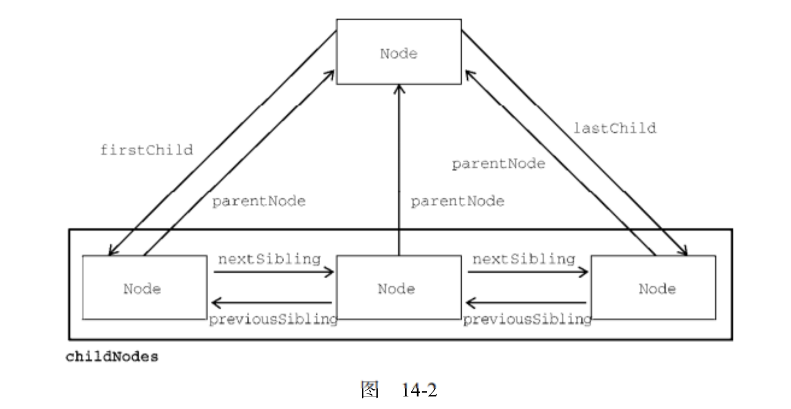

# 概述

> 文档对象模型（DOM，Document Object Model） 是 HTML 和 XML 文档的编程接口。
> DOM 表 示由多层节点构成的文档，通过它开发者可以添加、删除和修改页面的各个部分。
> 脱胎于网景和微软早期的动态 HTML（DHTML，Dynamic HTML），DOM 现在是真正跨平台、语言无关的表示和操作网页的方式。

- 节点层级

  > 任何 HTML 或 XML 文档都可以用 DOM 表示为一个由节点构成的层级结构。
  > 节点分很多类型，每种类型对应着文档中不同的信息和（或）标记，也都有自己不同的特性、数据和方法，而且与其他类型有某种关系。
  > 这些关系构成了层级，让标记可以表示为一个以特定节点为根的树形结构。

  - document 节点表示每个文档的根节点。
  - 根节点的唯一子节点是`<html>`元素,我们称之为文档元素（documentElement）。
    > 文档元素是文档最外层的元素，所有其他元素都存在于这个元素之内。
    > 每个文档只能有一个文档元素。
    > 在 HTML 页面中，文档元素始终是`<html>`元素。
    > 在 XML 文档中，则没有这样预定义的元素，任何元素都可能成为文档元素。
  - HTML 中的每段标记都可以表示为这个树形结构中的一个节点。

    1. 元素节点表示 HTML 元素，
    2. 属性节点表示属性
    3. 文档类型节点表示文档类型
    4. 注释节点表示注释。

  - Node 类型

    > Node 接口在 JavaScript 中被实现为 Node 类型，在除 IE 之外的所有浏览器中都可以直接访问这个类型
    > 所有节点类型都继承 Node 类型，因此所有类型都共享相同的基本属性和方法

    - 节点类型由定义在 Node 类型上的 12 个数值常量表示
      1. Node.ELEMENT_NODE
      2. Node.ATTRIBUTE_NODE
      3. Node.TEXT_NODE
      4. Node.CDATA_SECTION_NODE
      5. Node.ENTITY_REFERENCE_NODE
      6. Node.ENTITY_NODE
      7. Node.PROCESSING_INSTRUCTION_NODE
      8. Node.COMMENT_NODE
      9. Node.DOCUMENT_NODE
      10. Node.DOCUMENT_TYPE_NODE
      11. Node.DOCUMENT_FRAGMENT_NODE
      12. Node.NOTATION_NODE

    1. nodeName 与 nodeValue

       > nodeName 与 nodeValue 保存着有关节点的信息。这两个属性的值完全取决于节点类型。
       > nodeName 始终等于元素的标签名，而 nodeValue 则始终为 null。

    2. 节点关系

       - 文档中的所有节点都与其他节点有关系。
         > 这些关系可以形容为家族关系，相当于把文档树比作家谱。
       - 每个节点都有一个 childNodes 属性，其中包含一个 NodeList 的实例。
         > NodeList 是一个类数组 对象，用于存储可以按位置存取的有序节点。
         > 对 DOM 结构的查询，因此 DOM 结构的变化会自动地在 NodeList 中反映出来
         > 使用 item() 访问 NodeList 中的元素
         > 使用 Array.prototype.slice()把 NodeList 对象转换为数组
       - 每个节点都有一个 parentNode 属性，指向其 DOM 树中的父元素。
         > childNodes 中的所有节点都有同一个父元素，因此它们的 parentNode 属性都指向同一个节点
         > childNodes 列表中的每个节点都是同一列表中其他节点的同胞节点
       - 使用 previousSibling 和 nextSibling 可以在这个列表的节点间导航
         > 第一个节点的 previousSibling 属 性 是 null，最后一个节点的 nextSibling 属性也是 null
       - 父节点和它的第一个及最后一个子节点也有专门属性

         > firstChild 和 lastChild 分别指向 childNodes 中的第一个和最后一个子节点
         > someNode.firstChild 的值始终等于 someNode.childNodes[0]， 而 someNode.lastChild 的值始终等于 someNode.childNodes[someNode.childNodes.length-1]。
         > 如果只有一个子节点，则 firstChild 和 lastChild 指向同一个节点。
         > 如果没有子节点，则 firstChild 和 lastChild 都是 null。

       - 判断节点有一个或多个子节点
         > hasChildNodes()
         > 有一个或多个返回 true
       - 指向代表整个文档的文档节点的指针
         > ownerDocument
         > 所有节点都被创建它们（或自己所在）的文档所拥有，因为一个节点不可能同时存在于两个或者多个文档中。这个属性为迅速访问文档节点提供了便利，因为无需在文档结构中逐层上溯了。

       

    3. 操作节点

       > 因为所有关系指针都是只读的，所以 DOM 又提供了一些操纵节点的方法。

       - 在 childNodes 列表末尾添加节点

         > appendChild()

       - 将节点放到 childNodes 中的特定位置
         > insertBefore()
         > 接受两个参数
         > 要插入的节点和参照节点
         > 要插入的节点会变成参照节点的前一个同胞节点，并被返回。
         > 如果参照节点是 null，则 insertBefore() 与 appendChild()效果相同

       > appendChild() 和 insertBefore() 在插入节点时不会删除任何已有节点

       - 要插入的节点和要替换的节点

         > replaceChild()
         > 两个参数:
         > 要插入的节点
         > 要替换的节点
         > 使用 replaceChild()插入一个节点后，所有关系指针都会从被替换的节点复制过来。
         > 虽然被替换的节点从技术上说仍然被同一个文档所拥有，但文档中已经没有它的位置。

       - 移除节点

         > removeChild()
         > 一个参数
         > 要移除的节点

       - 返回与调用它的节点一模一样的节点
         > cloneNode()
         > 接收一个布尔值参数，表示是否深复制
         > 参数为 true 时，会进行深复制，即复制节点及其整个子 DOM 树。
         > 参数为 false 时,只会复制调用该方法的节点
         > 复制返回的节点属于文档所有，但尚未指定父节点，所以可称为孤儿节点（orphan）。
         > 可以通过 appendChild()、insertBefore()或 replaceChild()方法把孤儿节点添加到文档中
       - 处理文档子树中的文本节点。

         > normalize()

         - 由于解析器实现的差异或 DOM 操作等原因
           1. 会出现并不包含文本的文本节点
           2. 文本节点之间互为同胞关系

         > 会检测这个节点的所有后代，从中搜索上述两种情形。如果发现空文本节点，则将其删除；如果两个同胞节点是相邻的，则将其合并为一个文本节点。

- Document 类型

  > JavaScript 中表示文档节点的类型
  > 在浏览器中，文档对象 document 是 HTMLDocument 的实例（HTMLDocument 继承 Document），表示整个 HTML 页面。
  > document 是 window 对象的属性，因此是一个全局对象。
  > Document 类型可以表示 HTML 页面或其他 XML 文档，但最常用的还是通过 HTMLDocument 的实例取得 document 对象。
  > document 对象可用于获取关于页面的信息以及操纵其外观和底层结构。

  - Document 类型的特征:
    1. nodeType 等于 9
    2. nodeName 值为"#document"
    3. nodeValue 值为 null
    4. parentNode 值为 null
    5. ownerDocument 值为 null
    6. 子节点可以是 DocumentType（最多一个）、Element（最多一个）、ProcessingInstruction 或 Comment 类型

  1.  文档子节点

      > 可以是 DocumentType、Element、Processing-Instruction 或 Comment

      1. documentElement 属性，始终指向 HTML 页面中的`<html>`元素。
         > 虽然 document.childNodes 中始终有`<html>`元素，但使用 documentElement 属性可以更快更直接地访问该元素。
         > 所有主流浏览器都支持 document.documentElement 和 document.body
      2. DocumentType
         > <!doctype>标签是文档中独立的部分，其信息可以通过 doctype 属性（在浏览器中是 document.doctype）来访问

  2.  文档信息

      > document 作为 HTMLDocument 的实例，还有一些标准 Document 对象上所没有的属性。这些属性提供浏览器所加载网页的信息。

      1. title

         > 修改浏览器标题栏
         > document.title = "New page title";

      2. url
         > 获取完整 URL
      3. domain
         > 获取域名
         - 出于安全考虑，给 domain 属性设置的值是有限制,
           > 如果 URL 包含子域名如 p2p.wrox.com，则可以将 domain 设置为"wrox.com",不能给这个属性设置 URL 中不包含的值
           > // 页面来自 p2p.wrox.com
           > document.domain = "wrox.com"; // 成功
           > document.domain = "nczonline.net"; // 出错！
         - 设置 document.domain 是有用的
           > 因为跨源通信存在安全隐患，所以不同子域的页面间无法通过 JavaScript 通信。
           > 每个页面上把 document.domain 设置为相同的值，这些页面就可以访问对方的 JavaScript 对象了
         - 一旦放松就不能再收紧
           > 把 document.domain 设置为"wrox.com"之后，就不能再将其设置回"p2p.wrox.com"，后者会导致错误，
           > 页面来自 p2p.wrox.com
           > document.domain = "wrox.com"; // 放松，成功
           > document.domain = "p2p.wrox.com"; // 收紧，错误！
      4. referrer
         > 获取来源

  3.  定位元素
      > 获取某个或某组元素的引用，然后对它们执行某些操作
      1. getElementById()
         > 接收一个参数，即要获取元素的 ID，如果找到了则返回这个元素，如果没找到则返回 null
      2. getElementsByTagName()
         > 这个方法接收一个参数，即要获取元素的标签名，返回包含零个或多个元素的 NodeList
  4.  特殊集合
  5.  DOM 兼容性检测
  6.  文档写入
